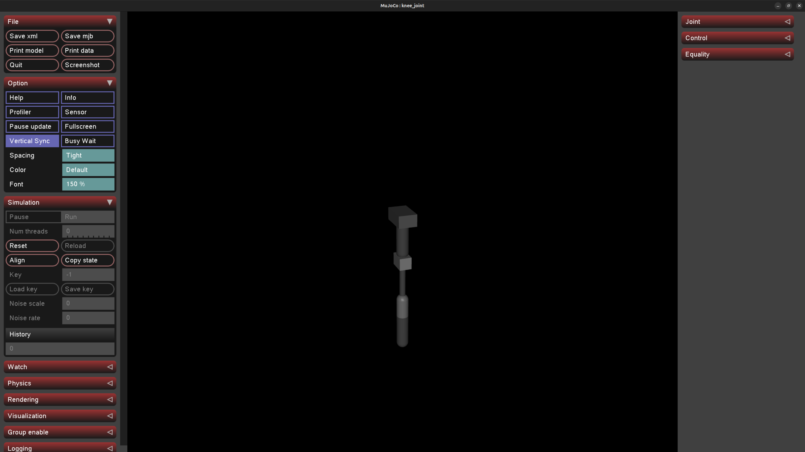

# Exoskeleton-KneeSupporting-Research
## **1. Overview**  
Exosketon Knee Supporting is a topic combination knowledge about `controlling theory`, `biological structure human body` , `material behavior` and `machine learning`.

## **2. Planning** 
- Research about `biological structure human body` (especially is knee)
- Related forces on Knee
- Mechanic replacement solution 
- Material lifelong, behaviour and elastic

**objective**: aim to get `sustainable solution` for exoskeleton

## **3. Working in Progress**
- Learning about `Impedance Control`: 
    - `Physical` Meaning and Relate
    - `Mathematicals` Relation
    - Pros and Cons
- Literature Review about IRC:
    - Understand the based `Impedance Control` in the paper review
    - Explore the `NDO (Nonlinear-Disturbance-Observer)`
- Done with basic therical and programming with `NDO`, `SMC` 
- Starting collab all into ones and develop the control settings 


# Researching
## Human Torque Observer (Nonlinear Observer)

---

### 1. Human-Exoskeleton Dynamics

The dynamic equation of the human-exoskeleton system is

```math
J\ddot{\theta}
+
B(\dot{\theta}-\dot{\theta}_t)
+
A\,\mathrm{sgn}(\dot{\theta}-\dot{\theta}_t)
+
\tau_g\sin\theta
+
\tau_e
=
\tau_e+\tilde{\tau}_h
```

Rearranging,

```math
\ddot{\theta}
=
\frac{1}{J}
\left(
-B(\dot{\theta}-\dot{\theta}_t)
-
A\,\mathrm{sgn}(\dot{\theta}-\dot{\theta}_t)
-
\tau_g\sin\theta
-
\tilde{\tau}_e
+
\tau_e
+
\tilde{\tau}_h
\right)
```

or equivalently,

```math
\ddot{\theta}
+
\frac{1}{J}
\left[
B(\dot{\theta}-\dot{\theta}_t)
+
A\,\mathrm{sgn}(\dot{\theta}-\dot{\theta}_t)
+
\tau_g\sin\theta
+
\tilde{\tau}_e
\right]
=
\frac{1}{J}
(\tau_e+\tilde{\tau}_h)
```

---

### 2. State-Space Representation

Define the state vector

```math
x=
\begin{bmatrix}
\theta\\
\dot{\theta}
\end{bmatrix}
```

Then

```math
\dot{x}
=
\begin{bmatrix}
\dot{\theta}\\
\ddot{\theta}
\end{bmatrix}
```

The nonlinear dynamics can be expressed as

```math
\boxed{
\dot{x}
=
F(x)
+
G(x)(\tau_e+\tilde{\tau}_h)
}
```

---

## Nonlinear Function

The nonlinear function is

```math
F(x)
=
\begin{bmatrix}
\dot{\theta}\\[1em]
\dfrac{1}{J}
\left(
-B(\dot{\theta}-\dot{\theta}_t)
-
A\,\mathrm{sgn}(\dot{\theta}-\dot{\theta}_t)
-
\tau_g\sin\theta
-
\tilde{\tau}_e
\right)
\end{bmatrix}
```

where

```math
x=(\theta,\dot{\theta})
```

and the exoskeleton velocity

```math
\dot{\theta}_t
```

is regarded as a measurable signal.

---

## Input Matrix

```math
G(x)
=
\begin{bmatrix}
0\\
\dfrac{1}{J}
\end{bmatrix}
```

---

# 3. Nonlinear Disturbance Observer

The nonlinear disturbance observer is defined by

```math
\boxed{
\begin{aligned}
\hat{\tau}_h &= z+p(x)\\
\dot{z}
&=
-L(x)
\left[
F(x)
-
G(x)
(\tau_e+z+p(x))
\right]
\end{aligned}
}
```

---

Substituting the system dynamics,

```math
\begin{bmatrix}
\dot{\theta}\\
\ddot{\theta}
\end{bmatrix}
=
\begin{bmatrix}
\dot{\theta}\\[1em]
\dfrac{1}{J}
\left(
-B(\dot{\theta}-\dot{\theta}_t)
-
A\,\mathrm{sgn}(\dot{\theta}-\dot{\theta}_t)
-
\tau_g\sin\theta
-
\tilde{\tau}_e
\right)
\end{bmatrix}
+
\begin{bmatrix}
0\\
\dfrac{1}{J}
\end{bmatrix}
(\tau_e+\hat{\tau}_h)
```

Therefore,

```math
\boxed{
\begin{aligned}
\dot{\theta}
&=
\dot{\theta}
\\[0.5em]
\ddot{\theta}
&=
\dfrac{1}{J}
\left(
-B(\dot{\theta}-\dot{\theta}_t)
-
A\,\mathrm{sgn}(\dot{\theta}-\dot{\theta}_t)
-
\tau_g\sin\theta
-
\tilde{\tau}_e
\right)
+
\dfrac{1}{J}
(\tau_e+\hat{\tau}_h)
\end{aligned}
}
```

---

# 4. Control Flow

## Step 1. Outer-loop Error

The tracking error is

```math
e_\theta(t)
=
\theta_d(t)-\theta(t)
```

Taking Laplace transform,

```math
E_\theta(s)
=
\Theta_d(s)-\Theta(s)
```

---

## Step 2. Wiener Model

The estimated human torque is

```math
\tilde{\tau}_h
=
W(s)
\left[
\Theta_d(s)-\Theta(s)
\right]
```

---

## Step 3. IRC Controller

The exoskeleton control torque is

```math
\tilde{\tau}_e
=
G_{IRC}(s)\Theta(s)
```

---

## Total Input Torque

The total actuator input becomes

```math
\tau_{in}(s)
=
\tilde{\tau}_h(s)
+
\tilde{\tau}_e(s)
```

Substituting,

```math
\tau_{in}(s)
=
W(s)
\left[
\Theta_d(s)-\Theta(s)
\right]
+
G_{IRC}(s)\Theta(s)
```

---

# 5. Human Error Dynamics

Define the admittance

```math
G(s)
=
\frac{\Theta(s)}{Z_d(s)}
```

Hence,

```math
\tau_{in}(s)
=
Z_d(s)
\left[
W(s)(\Theta_d(s)-\Theta(s))
+
G_{IRC}(s)\Theta(s)
\right]
```

---

Expanding,

```math
Z_d(s)\Theta(s)
=
W(s)\Theta_d(s)
-
W(s)\Theta(s)
+
G_{IRC}(s)\Theta(s)
```

Moving all terms involving \(\Theta(s)\) to the left-hand side,

```math
\Theta(s)
\left[
Z_d(s)
+
W(s)
-
G_{IRC}(s)
\right]
=
W(s)\Theta_d(s)
```

Thus,

```math
\boxed{
\Theta(s)
=
\frac{W(s)}
{Z_d(s)+W(s)-G_{IRC}(s)}
\Theta_d(s)
}
```

Finally,

```math
\boxed{
\frac{\Theta(s)}
{\Theta_d(s)}
=
\frac{W(s)}
{Z_d(s)+W(s)-G_{IRC}(s)}
}
```

---

# 6. Human-Exoskeleton Model

The combined system parameters are

```math
J=J_h+J_e
```

```math
B=B_h+B_e
```

```math
\tau_g=\tau_{gh}+\tau_{ge}
```

The overall dynamics become

```math
J\ddot{\theta}
+
B(\dot{\theta}-\dot{\theta}_t)
+
A\,\mathrm{sgn}(\dot{\theta}-\dot{\theta}_t)
+
\tau_g\sin\theta
+
\tau_e
=
\tau_c+\tau_h
```

where

- $h$: Human contribution
- $e$: Exoskeleton contribution

---

# 7. IRC (Impedance Reduction Control)

Overall structure

```text
Human Torque
      │
      ▼
Desired Admittance
      │
      ▼
Reference Angle θd
      │
      ▼
Sliding Mode Controller
      │
      ▼
Exoskeleton Torque τe
```

The controller utilizes

- Desired Admittance
- Sliding Mode Controller (SMC)
- Nonlinear Human Torque Observer

---

# 8. Closed-loop Dynamic Equation

The final closed-loop dynamics are

```math
M(\theta)\ddot{\theta}
+
C(\theta,\dot{\theta})\dot{\theta}
+
G(\theta)
=
\tau_h
+
SMC(\theta,\dot{\theta},\theta_d)
```

where

- $M(\theta)$ is the inertia matrix.
- $C(\theta,\dot{\theta})$ is the Coriolis/centrifugal matrix.
- $G(\theta)$ is the gravitational torque.
- $\tau_h$ is the human torque.
- $SMC(\cdot)$ is the Sliding Mode Controller.

---

# Notes

- Human torque is estimated using a nonlinear disturbance observer.
- Desired admittance generates the desired joint trajectory.
- The SMC controller tracks the desired trajectory.
- The IRC controller reduces the apparent impedance of the exoskeleton.
- The transfer function of the human-exoskeleton interaction is

```math
\boxed{
\frac{\Theta(s)}
{\Theta_d(s)}
=
\frac{W(s)}
{Z_d(s)+W(s)-G_{IRC}(s)}
}
```

## Simulation

Working around with simulation the `exoskeleton` with `MuJuCo`

