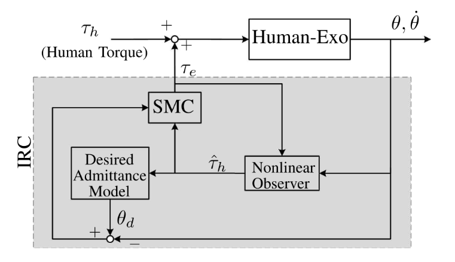

# Control Theory in Exoskeleton

## I. Overall `Control Theory` for Exoskeleton - Knee Supporter


## **Derivation:**

### 1. Outer loop error
---
```math
e_\theta(t) = \theta_r(t) - \theta(t)
```

```bash
=> Apply `LapLace Transform`
```
```math
E_\Theta(s) = \Theta_r(s) - \Theta(s)
```
### 2. Wearer Model
---
We called this short as $W(s)$:
$$\tau_h = W(s)[\Theta_r(s) - \Theta(s)]$$
### 3. IRC (Impedance Reduction Controller)
---
```math
\begin{gathered}
\tau_e(s)=C_{\mathrm{IRC}}(s)\,\Theta(s), \\[0.5em]
\tau_{in}(s)=\tau_h(s)+\tau_e(s), \\[0.5em]
\boxed{
\tau_{in}(s)
=
W(s)\bigl(\Theta_r(s)-\Theta(s)\bigr)
+
C_{\mathrm{IRC}}(s)\,\Theta(s)
}
\end{gathered}
```
### 4. Human Exoskeleton Dynamics
---
```math
\Theta(s)=\frac{\tau_{in}(s)}{Z_d(s)}
```

```math
\boxed{
\Theta(s)
=
\frac{1}{Z_d(s)}
\left[
W(s)\bigl(\Theta_r(s)-\Theta(s)\bigr)
+
C_{\mathrm{IRC}}(s)\,\Theta(s)
\right]
}
```

## II. Human Exoskeleton Model
```math
J\ddot{\theta} + B(\dot{\theta} - \dot{\theta_t}) + Asgn(\dot{\theta} - \dot{\theta_t}) + \tau_{g}*sin(\theta) + \tau_{l} = \tau_{e} + \tau_{h}
```  
**Where**:
- $J = J_{h} + J_{e}$
- $B = B_{h} + B_{e}$
- $\tau_{g} = \tau_{g,h} + \tau_{g,e}$


```math
\boxed{
(J_{h} + J_{e}) * \ddot{\theta} +
(B_{h} + B_{e})(\dot{\theta} - \dot{\theta_{t}}) + 
Asgn(\dot{\theta} - \dot{\theta_{t}}) + 
(\tau_{g,h} + \tau_{g,e}) * sin(\theta) + \tau_{l}
= \tau_{e} + \tau_{h}
}
```

**Where**
$h$: is come from human $\rightarrow$ anything, eg: forces, torque,....
$e$: is come from exoskeleton, the same definition of $h$

## III. IRC (Structure)


