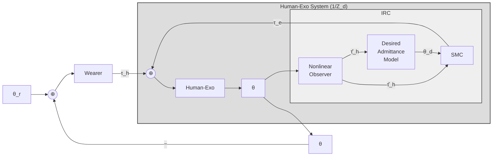

# Control Theory in Exoskeleton

## I. Overall `Control Theory` for Exoskeleton - Knee Supporter



## **Derivation:**

### 1. Outer loop error
---
```math
e_\theta(t) = \theta_r(t) - \theta(t)
```

```python
# => Apply `LapLace Transform`
```
```math
E_\Theta(s) = \Theta_r(s) - \Theta(s)
```
### 2. Wearer Model
---
We called this short as $W(s)$:
$$\tau_h = W(s)[\Theta_r(s) - \Theta(s)]$$
### 3. IRC (Impedance Reduction Controller)
---
```math
\begin{gathered}
\tau_e(s)=C_{\mathrm{IRC}}(s)\,\Theta(s), \\[0.5em]
\tau_{in}(s)=\tau_h(s)+\tau_e(s), \\[0.5em]
\boxed{
\tau_{in}(s)
=
W(s)\bigl(\Theta_r(s)-\Theta(s)\bigr)
+
C_{\mathrm{IRC}}(s)\,\Theta(s)
}
\end{gathered}
```
### 4. Human Exoskeleton Dynamics
---
```math
\Theta(s)=\frac{\tau_{in}(s)}{Z_d(s)}
```

```math
\boxed{
\Theta(s)
=
\frac{1}{Z_d(s)}
\left[
W(s)\bigl(\Theta_r(s)-\Theta(s)\bigr)
+
C_{\mathrm{IRC}}(s)\,\Theta(s)
\right]
}
```

## II. Human Exoskeleton Model
```math
J\ddot{\theta} + B(\dot{\theta} - \dot{\theta_t}) + Asgn(\dot{\theta} - \dot{\theta_t}) + \tau_{g}*sin(\theta) + \tau_{l} = \tau_{e} + \tau_{h}
```  
**Where**:
- $J = J_{h} + J_{e}$
- $B = B_{h} + B_{e}$
- $\tau_{g} = \tau_{g,h} + \tau_{g,e}$


```math
\boxed{
(J_{h} + J_{e}) * \ddot{\theta} +
(B_{h} + B_{e})(\dot{\theta} - \dot{\theta_{t}}) + 
Asgn(\dot{\theta} - \dot{\theta_{t}}) + 
(\tau_{g,h} + \tau_{g,e}) * sin(\theta) + \tau_{l}
= \tau_{e} + \tau_{h}
}
```

**Where**
$h$: is come from human $\rightarrow$ anything, eg: forces, torque,....
$e$: is come from exoskeleton, the same definition of $h$

## III. IRC (Structure)
```math
\hat{\tau_{h}} \rightarrow Desired Admintance \rightarrow \theta_{d} \rightarrow SMC \rightarrow \tau_{e}
```
**Where:**
- $\hat{\tau_{e}} = Nonlinear-Observer(\theta, \dot{\theta}, \tau_{e})$
- $\theta_{d} = Desired-Admintance(\hat{\tau_{e}})$
- $\tau_{e} = SMC(\theta, \dot{\theta}, \theta_{d})$ 

```python
# Come up with the final equation
```

```math
\rightarrow M(\theta)\cdot \ddot{\theta} + C(\theta, \dot{\theta}) \cdot \dot{\theta} + G(\theta) = \tau_{h} + SMC(\theta, \dot{\theta}, \theta_{d})

```

### IV. Human Torque Observer (Nonlinear Observer)

#### 1. System Dynamics

$$J\ddot\theta + B(\dot\theta-\dot\theta_t) + A\,\text{sgn}(\dot\theta-\dot\theta_t) + Tg\sin\theta + \tau_u = \tau_e+\tau_h \qquad (1)$$

$$\ddot\theta + \frac{1}{J}\Big[B(\dot\theta-\dot\theta_t)+A\,\text{sgn}(\dot\theta-\dot\theta_t)+Tg\sin\theta+\tau_u\Big] = \frac{\tau_e+\tau_h}{J}$$

Define the state vector:

$$x=\begin{bmatrix}\theta\\ \dot\theta\end{bmatrix}\quad\Rightarrow\quad \dot x=\begin{bmatrix}\dot\theta\\ \ddot\theta\end{bmatrix}=F(x)+G(x)\cdot(\tau_e+\tau_h)\qquad (1)$$

with

$$F(x)=\begin{bmatrix}\dot\theta\\[4pt] \dfrac{1}{J}\Big(-B(\dot\theta-\dot\theta_t)-A\,\text{sgn}(\dot\theta-\dot\theta_t)-Tg\sin\theta-\tau_u\Big)\end{bmatrix},\qquad G(x)=\begin{bmatrix}0\\[4pt] \dfrac{1}{J}\end{bmatrix}$$

*(only $\dot\theta$ observed — measured states are $(\theta,\dot\theta)$)*

So, explicitly:

$$\begin{bmatrix}\dot\theta\\ \ddot\theta\end{bmatrix} = \begin{bmatrix}\dot\theta\\[4pt] \dfrac{1}{J}\Big(-B(\dot\theta-\dot\theta_t)-A\,\text{sgn}(\dot\theta-\dot\theta_t)-Tg\sin\theta-\tau_u\Big)\end{bmatrix} + \begin{bmatrix}0\\[4pt] \dfrac{1}{J}\end{bmatrix}(\tau_e+\tau_h)$$

#### 2. Observer Design (Proof) — labeled (α)

Estimate of human torque:

$$\hat\tau_h = z + p(x)$$

where $p(x)$ is an auxiliary (gain) function and $z$ is the observer's internal state, governed by:

$$\dot z = L\big(-F(x)-G(x)(\tau_e+z+p(x))\big)$$

*[This block was the hardest to read — the "Proof (α)" box. Reconstructed to match the standard NDO structure, since it's consistent with the final result derived below.]*

With $L(x)=\dfrac{\partial p(x)}{\partial x}=[k_1\ \ k_2]$ (row vector, satisfies the observer gain condition).

**From (2):**

$$\dot{\hat\tau}_h = \dot z + L(x)\,\dot x$$

Substituting $\dot x = F(x)+G(x)(\tau_e+\hat\tau_h)$ and the $\dot z$ expression above:

$$\dot{\hat\tau}_h = L\big(-F(x)-G(x)(\tau_e+\hat\tau_h)\big) + L\big(F(x)+G(x)(\tau_e+\hat\tau_h)\big) + LG(x)\tau_h$$

$$\Rightarrow\quad \boxed{\dot{\hat\tau}_h = LG(\tau_h-\hat\tau_h)}$$

where $\tau_h$ = actual human torque, $\hat\tau_h$ = estimated human torque.

#### 3. Verifying $L$ Satisfies the Design Condition

$$L=\frac{\partial p(x)}{\partial x}=[k_1\ \ k_2]$$

From (2): $\dot{\hat\tau}_h = LG(\tau_h-\hat\tau_h)$

Since $\tau_h = z+p(x)$ and $\dfrac{dP(x)}{dx}\dot x=[k_1\ \ k_2]\begin{bmatrix}\dot\theta\\\ddot\theta\end{bmatrix}=k_1\dot\theta+k_2\ddot\theta$

Substitute (2) into this ⇒

$$\dot{\hat\tau}_h = L\big(-F(x)-G(x)(\tau_e+z+p(x))\big) + \dot z + L\dot x$$

*(a few lines here in the margin appear to re-derive the same identity as a consistency check — omitted to avoid duplicating errors from illegible strokes)*

#### 4. Sliding Mode Control–Based Controller

**An NDO-based SMC is used to ensure a high control gain/robustness.**

Human joint torque observer is treated as an external disturbance estimate in the control scheme.

**Detailing:**

$$\dot{\hat\tau}_h = L\big(-F(x)-G(x)(\tau_e+\hat\tau_h)\big) = -L\big(F(x)+G(x)\tau_e\big) - LG(x)\hat\tau_h$$

$$\dot{\hat\tau}_h = (-1)(L\dot F(x)) + \frac{1}{J}G(x)\dot{\hat\tau}_h = L\big(-F(x)-G(x)\big)\big(\ddot\theta_e + LG(x)\dot{\hat\tau}_h\big) + L\big(F(x)+G(x)\big)\big(\ddot\theta_e+\dot{\hat\tau}_h\big) + LG(x)\dot{\hat\tau}_h$$

*[This central derivation block is the most illegible portion of the page — several overlapping terms with $F(x)$, $G(x)$, $\dot\theta_e$, $\dot{\hat\tau}_h$. I've transcribed the visible symbol groupings but would recommend double-checking this block against the original algebra, since I can't fully verify term-by-term accuracy here.]*

$$\Rightarrow \dot{\hat\tau}_h = z + LG(x)\dot{\hat\tau}_h$$

$$\Rightarrow \dot{\hat\tau}_h = LG(\hat\tau_h-\tau_h)$$

This gets:

$$\frac{\dot{\hat\tau}_h}{\hat\tau_h} = LG(x)$$

#### 5. Sliding Mode Control Concept

1. Human effort is considered as an external disturbance in the control scheme.
2. Use human joint torque observer as an external disturbance in controller.

**⇒ Sliding surface:**

$$S = C_1\cdot\tilde e + \dot{\tilde e},\qquad \tilde e=\theta_d-\theta$$

---

**Note on transcription confidence:** Sections 1, 2 (boxed result), and 5 are transcribed with high confidence — the notation is clear and internally consistent (the boxed result $\dot{\hat\tau}_h = LG(\tau_h-\hat\tau_h)$ matches the standard nonlinear disturbance observer form). Section 4's middle derivation block is the weakest link — the handwriting there has several overlapping/crossed-out terms that I couldn't disambiguate with full confidence. If you can re-photograph that block at higher resolution or closer up, I can redo just that piece more precisely.